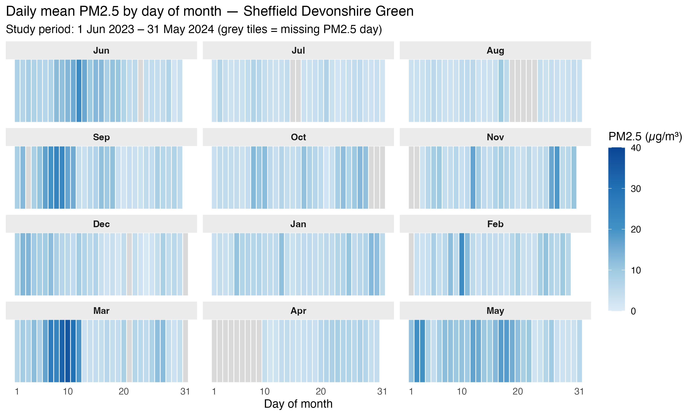
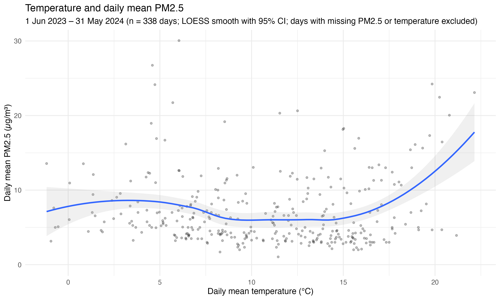
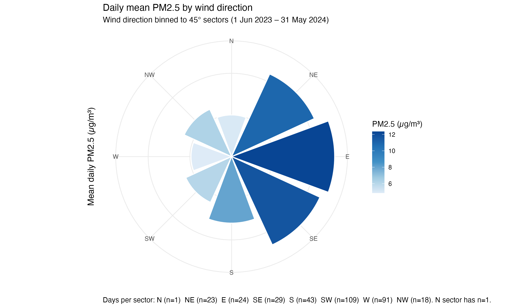
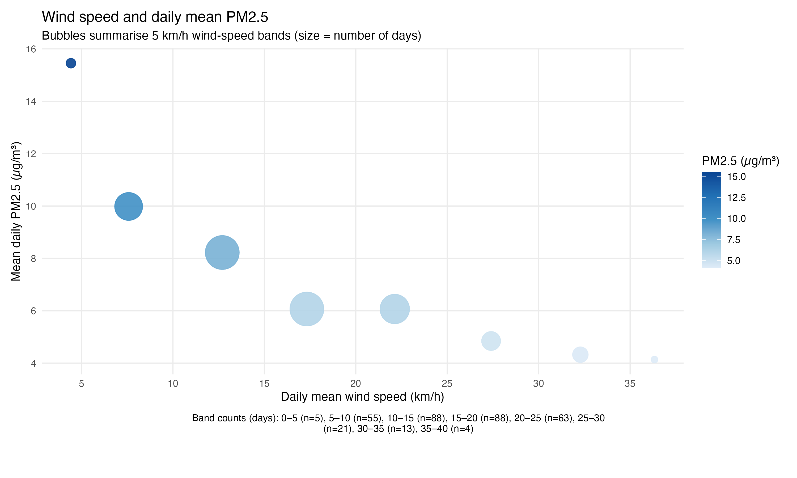

# IJC-445-Data-Visualisation-Assignment
# PM2.5 and meteorology — Sheffield Devonshire Green (2023–2024)

This project explores how meteorological conditions (temperature, wind speed, wind direction) are associated with PM2.5 patterns at Sheffield Devonshire Green from **1 June 2023 to 31 May 2024**.

Research Question: -	How are meteorological factors, specifically temperature, wind speed and wind direction, associated with PM2.5 patterns at Sheffield Devonshire Green?

## Data
- **PM2.5:** OpenAQ (daily mean derived from timestamped observations)
- **Meteorology:** OpenMeteo (daily mean temperature, wind speed, wind direction)

Datasets are stored in data/. The script reads data/sheffieldpm2.5.csv and data/openmeteo_tempandwind.csv.

## Outputs
- Individual figures saved to `figures/`
- Composite figure: `figures/composite.png`

## Figures

### Figure 1 — Daily mean PM2.5 (calendar heatmap)
Shows daily mean PM2.5 across the study period, with missing days shown in grey.  

### Figure 2 — Temperature vs PM2.5 (scatter + LOESS)
Scatter of daily mean temperature vs daily mean PM2.5 with LOESS smooth and 95% CI.  

### Figure 3 — PM2.5 by wind direction (polar bar)
Mean daily PM2.5 by 45° wind-direction sector (caption includes counts per sector).  

### Figure 4 — Wind speed vs PM2.5 (bubble summary)
Mean PM2.5 within 5 km/h wind-speed bands; bubble size shows number of days.  

## Composite visualisation

## Reproducibility
Run: `code/analysis.R`
