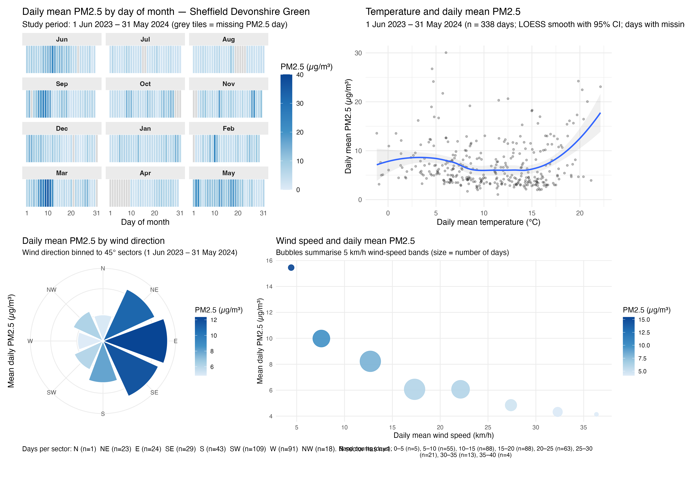

# IJC-445-Data-Visualisation-Assignment
# PM2.5 and meteorology — Sheffield Devonshire Green (2023–2024)

This project explores how meteorological conditions (temperature, wind speed, wind direction) are associated with PM2.5 patterns at Sheffield Devonshire Green from **1 June 2023 to 31 May 2024**.

## Data
- **PM2.5:** OpenAQ (daily mean derived from timestamped observations)
- **Meteorology:** OpenMeteo (daily mean temperature, wind speed, wind direction)

Datasets are stored in data/. The script reads data/sheffieldpm2.5.csv and data/openmeteo_tempandwind.csv.

## Outputs
- Individual figures saved to `figures/`
- Composite figure: `figures/composite.png`

## Composite visualisation

## Reproducibility
Run: `code/analysis.R`
